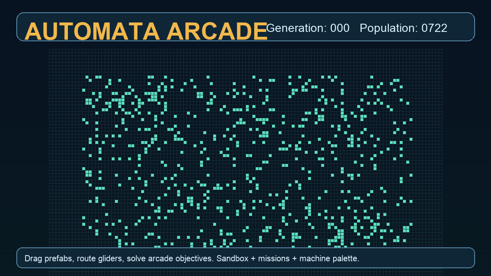
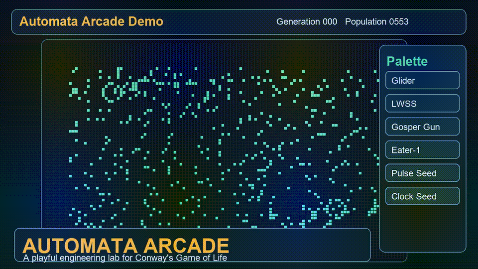
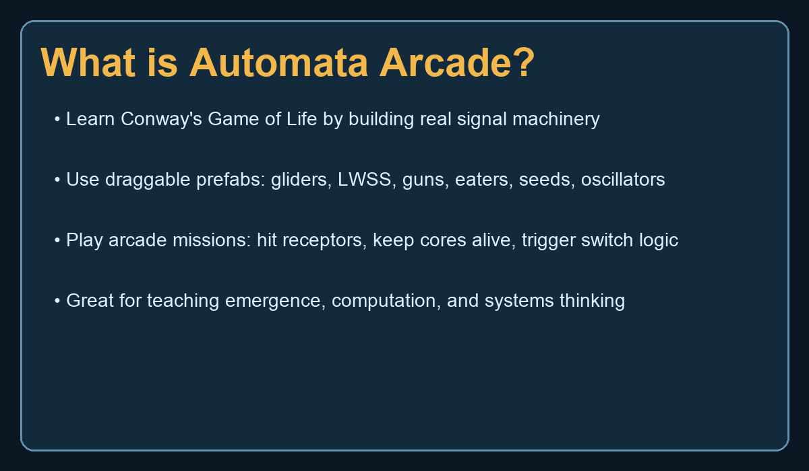
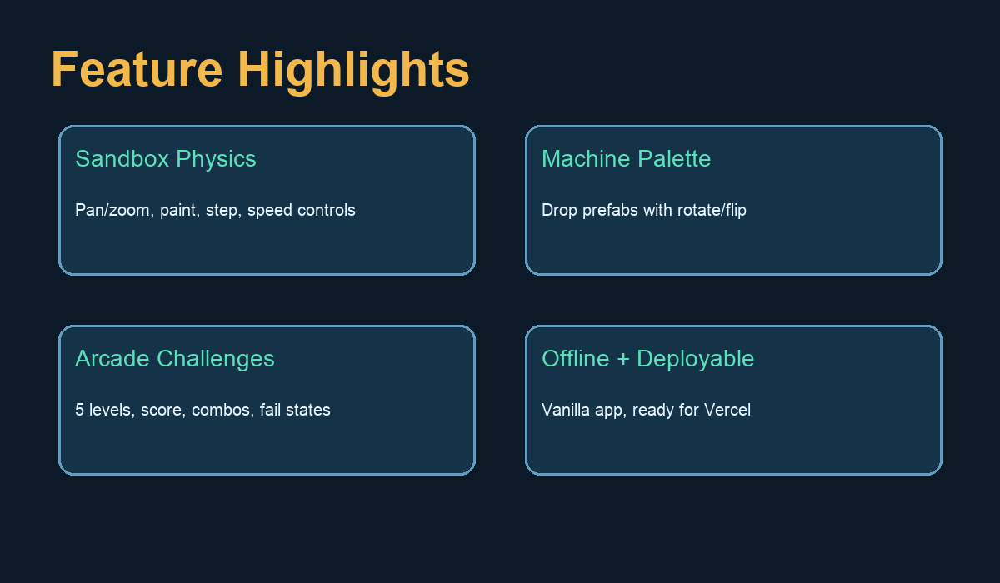

# Automata Arcade: Building a Playable Lab for Conway’s Game of Life

*Draft for review by Joel. Not published.*

When people hear “Conway’s Game of Life is Turing complete,” their eyes usually do one of two things: either widen with curiosity, or glaze over in fear.

I wanted to make something that pushes everyone into the first reaction.

So I built **Automata Arcade**, a browser-based Game of Life sandbox where you can drag machine components onto the grid, route signals, and then use those same mechanics in a playful challenge mode.

---

## Quick links

- Live demo: https://automata-arcade.vercel.app
- Repo: https://github.com/jclosure/automata-arcade

---

## Demo video

<video controls muted loop playsinline width="960" src="docs/media/automata-arcade-demo.mp4"></video>

Fallback GIF:

---

## Why build this?

Most Life simulators are either:
- too barebones for newcomers, or
- deep but intimidating for anyone who just wants to experiment.

Automata Arcade is designed as a bridge:
- **Easy enough to start in seconds**
- **Deep enough to teach real computational behavior**
- **Playful enough to keep people exploring**

In other words, not just a simulator. A little **engineering playground**.

---

## What it does

At its core, it’s Conway’s Game of Life with modern UX and game scaffolding.

### Sandbox mode

You can:
- pan and zoom a large grid
- draw and erase live cells directly
- play, pause, and single-step generations
- adjust simulation speed
- drop predefined mechanisms from a palette
- rotate and flip patterns before placement

### Draggable mechanism palette

Included core patterns:
- Glider
- LWSS (Lightweight Spaceship)
- Gosper glider gun
- Eater-1
- Pulse seed
- Clock seed

Custom prefabs are included too, so users can quickly prototype interactions without hunting pattern files.

### Inspector + guidance

The right-side inspector explains selected prefabs and gives tactical hints, which helps users go from “I placed a thing” to “I intentionally built behavior.”

---

## Arcade mode: where learning gets sticky

Sandbox is powerful, but goals make people learn faster.

So I layered in an **arcade mission mode** with level objectives like:
- hit receptor zones with glider traffic
- keep a beacon alive for N generations
- trigger multiple switch-like targets
- hold population bands under timing pressure

This creates a loop of:
1. hypothesis
2. build
3. observe
4. tweak
5. win or fail with feedback

That loop is exactly what makes automata intuition click.

---

## Visual explainers

---

## Product and technical shape

Automata Arcade is intentionally simple to run:
- Vanilla **HTML/CSS/JS**
- Tiny Node server for local dev
- Works offline
- Easy to deploy as static app

Project path:
- `~/projects/automata-arcade`

Live demo:
- https://automata-arcade.vercel.app

GitHub:
- https://github.com/jclosure/automata-arcade

---

## What surprised me

Two things stood out while building this:

1. **The UX matters as much as the automata rules**

   Game of Life logic is fixed, but the quality of interaction determines whether people feel “this is magical” or “this is homework.”

2. **A tiny game wrapper massively improves comprehension**

   Objectives, scores, and mission framing gave users permission to experiment with intent, not just watch patterns drift.

---

## What’s next

Potential next upgrades:
- Logic cookbook presets (signal splitters, delay lines, pseudo-gates)
- Shareable board seeds
- Challenge editor for teachers/creators
- Replay and annotation mode
- Classroom lesson packs

---

## Closing

Automata Arcade started as a prototype request and turned into a genuinely useful teaching tool.

If you’ve ever wanted to *feel* how computation emerges from simple local rules, this is the kind of toy that teaches you fast.

And yes, watching gliders do tiny acts of violence at scale is still deeply satisfying.

---

*Draft status: ready for Joel review before publish.*
