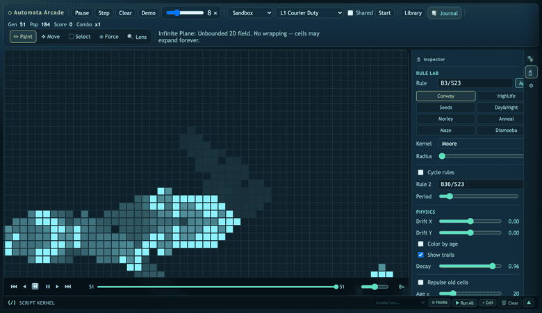

<div align="center">

# Automata Arcade

### A browser-based cellular automaton laboratory — from beginner sandbox to scriptable research instrument.



[](https://automata-arcade.vercel.app)
[](https://developer.mozilla.org/en-US/docs/Web/JavaScript)
[](https://threejs.org)
[](#)

</div>

---

## What is it?

Automata Arcade runs Conway's Game of Life — and much more — entirely in your browser. Start by painting cells and watching them evolve. Layer in force fields, zones with custom rules, and Lenia continuous automata. Write live JavaScript that hooks into the simulation pipeline. Study collisions in slow motion on the time machine. Run the same rules on a sphere, torus, Klein bottle, or Möbius strip. Build NOT gates. Publish your discoveries to the Journal.

No install required. No server. All computation is local.

---

## Quick Start

```bash
git clone https://github.com/jclosure/automata-arcade.git
cd automata-arcade
npm install
npm run serve
# → http://localhost:5173
```

Or hit the [Live Demo](https://automata-arcade.vercel.app) directly.

---

## Feature Map

| Area | What you get |
|---|---|
| 🎨 **Canvas & Modes** | Paint, erase, pan, select (rotate/flip/move), stamp prefabs with live ghost preview, force-paint, zone-draw, lens-draw, object mode |
| ⚙️ **Rule Engine** | B/S notation editor, 20+ named presets, per-zone rule overrides, dual-rule swap, Lenia continuous automata |
| 🧲 **Force Fields** | Attractor and repeller fields that steer the alive-cell set each step |
| 🗺️ **Zones** | Rectangular grid regions with independent B/S rules; used by Arcade for objectives and available in Sandbox for experiments |
| 🔬 **Lenses** | Circular magnification overlays that live on the canvas — zoom in on any region without zooming the whole board |
| ⏱️ **Time Machine** | 600-frame history buffer — scrub, rewind, step frame-by-frame, fork from any point |
| 📦 **Prefab Palette** | 30+ patterns across Required, Custom, and Circuit categories; stamp mode with live ghost, rotation (R), flip (F) |
| ✂️ **Selection** | Draw a region, translate, rotate 90° (R), flip (F), copy/cut/paste, capture to custom prefab |
| 🌐 **3D Manifolds** | Live GoL on Sphere, Torus, Klein Bottle, Möbius Strip, Cylinder via Three.js WebGL |
| 🏆 **Arcade** | 5 scored missions with zones, win states, and score multipliers |
| 🎓 **Circuit Academy** | 7 guided levels teaching GoL signal logic — gliders, eaters, NOT/OR/AND gates, signal crossing |
| 📓 **Journal** | Live research journal — auto-detects patterns, records snapshots, pins, timeline markers, cinematic scenes |
| 💻 **Script Kernel** | Bottom-panel JS code editor with a live simulation SDK — hook into `afterStep`, `beforeDraw`, `afterDraw` pipelines |
| 📊 **Analysis Lab** | Period detector, pattern classifier, population tracking |
| 🧬 **Evo Lab** | Automatic rule mutation toward target population densities |
| 📐 **Physics Lab** | Kernel shape (Moore / Von Neumann / Extended) and radius controls |

---

## The Board

### Canvas Modes

Switch modes from the toolbar or keyboard:

| Key | Mode | What it does |
|---|---|---|
| `P` | **Paint** | Left-click/drag to draw · right-click/drag to erase |
| `M` | **Move** | Drag to pan the camera |
| `S` | **Select** | Draw a rectangle · then drag to translate, `R` to rotate 90°, `F` to flip · `Del` to delete · `Ctrl+C/X/V` to copy/cut/paste |
| `V` | **Force** | Paint attract/repel force fields |
| — | **Zone** | Draw rectangular rule-override zones |
| — | **Lens** | Draw circular magnification overlays |
| — | **Object** | Click to select and manipulate zones, fields, or lenses |
| — | **Prefab Stamp** | Entered by clicking a palette card · `R` rotate · `F` flip · click to place (multi-stamp) · `Esc` to exit |

### Mouse Controls

| Action | Result |
|---|---|
| Left-click / drag | Draw or act in current mode |
| Right-click / drag | Erase (paint mode) |
| Scroll wheel | Zoom in / out |
| Drag in Move mode | Pan the view |
| Right-drag on sphere | Rotate the 3D view |

### Keyboard Shortcuts

| Key | Action |
|---|---|
| `Space` | Play / Pause |
| `N` | Step one generation forward |
| `B` | Step one generation backward |
| `C` | Clear board |
| `D` | Load demo scene |
| `G` | Toggle grid overlay |
| `R` | Rotate 90° — stamp mode or selection |
| `F` | Flip horizontally — stamp mode or selection |
| `Esc` | Return to Paint mode / cancel stamp / deselect |
| `1` | Sandbox mode |
| `2` | Arcade mode |
| `3–7` | 3D manifold modes (Sphere, Torus, Klein, Möbius, Cylinder) |

---

## Rule Engine

The rule editor lives in the right-sidebar **Inspector** panel (Physics / Rule tabs).

**B/S notation** — Born and Survive neighbour counts. The default `B3/S23` means: a dead cell with exactly 3 alive neighbours is born; an alive cell with 2 or 3 alive neighbours survives.

**Named presets** — 20+ rules including HighLife, Seeds, Day & Night, Replicator, Diamoeba, 2×2, Move, Coagulations, and more.

**Per-zone rules** — Each zone can carry its own B/S override. Cells in that zone step with local rules while the rest of the board uses the global rule.

**Lenia mode** — Switch the engine to continuous Lenia: a smooth, kernel-based automaton that produces organic-looking creatures. Controlled by growth function parameters (µ, σ) and kernel radius. Visualised with a perceptual colour ramp (black → violet → teal → amber → white).

**Kernel shape & radius** — Moore (8-cell), Von Neumann (4-cell), or Extended neighbourhood. Radius 1–5. Affects neighbour counting for standard B/S rules.

**Evo Lab** — Mutates B/S rules automatically over time, nudging them toward a target population density. Watch rules evolve live.

---

## Force Fields

Draw attract or repel fields from the **Force** toolbar button (or `V`). Fields exert a probabilistic bias on cell births near their boundary each step — attractors pull life inward, repellers push it out.

Each field shows:
- Drag the centre to reposition
- Drag the edge to resize
- Toggle visibility or delete via the Fields panel in the sidebar

---

## Zones

Zones are rectangular overlays that override the global B/S rule within their boundary. Create them from the **Zone** toolbar button or the Zones panel.

In **Arcade** mode, coloured zones are objective targets — amber receptors, orange switches, blue core blocks, and red danger zones.

In **Sandbox** mode, zones let you set up reaction boundaries, rule-gradient experiments, or protected regions.

---

## Lenses

Draw circular magnification overlays from the **Lens** toolbar button. Each lens renders an enlarged view of the cells beneath it without zooming the whole canvas. Drag to reposition, drag the edge to resize. Multiple lenses stack.

---

## ⏱️ Time Machine

Every generation is recorded — up to **600 frames** of full board state.

```
  ⏮   ⏴   ⏪   ▶   ⏵   ⏭        gen 0 ════════●════════ gen 342
  │    │    │    │    │    │
  │    │    │    │    │    └─ jump to newest frame
  │    │    │    │    └─ step forward (N)
  │    │    │    └─ play / pause (Space)
  │    │    └─ play backward through history
  │    └─ step backward (B)
  └─ jump to oldest recorded frame
```

- **Scrubbing** — click or drag the track to jump to any generation instantly
- **Forking** — scrub back and press Play; history after that point is discarded and a new branch grows
- **Speed** — 1×, 2×, 4×, 8×, 15×, 25×, 30× steps/second via the speed slider

---

## 📦 Prefab Palette

Click any card to enter **stamp mode** — a live teal ghost follows your cursor. **Drag** a card directly onto the canvas to place immediately.

| Key | Action (stamp mode) |
|---|---|
| `R` | Rotate ghost 90° clockwise |
| `F` | Flip ghost horizontally |
| Click on canvas | Stamp the pattern (stays in stamp mode for multi-placing) |
| `Esc` | Exit stamp mode |

A hint bar above the timeline shows the current transform and available keys while you're stamping.

### Pattern Categories

**Required** — Universal building blocks: Glider, LWSS, Gosper Glider Gun, Eater-1, Pulse Seed, Clock Seed.

**Custom** — Hand-crafted dynamics: Beacon, Toad, Blinker Train, Spark Crab, Drift Fork, Pinwheel Seed, Mini Lab Core.

**Circuit** — Verified signal-logic components:
- *Still lives*: Block, Beehive, Tub, Loaf
- *Oscillators*: Blinker (p2), Pulsar (p3), Pentadecathlon (p15)
- *Seeds*: R-Pentomino, Acorn, Die Hard
- *Gates*: Herschel, Signal Train, Annihilator (NOT), Turn Gate, Gosper Gun (NW)

The right-sidebar **Inspector** shows each pattern's dimensions, period, and usage tip.

---

## ✂️ Selection

Press `S` to enter select mode. Draw a rectangle around any region, then:

| Action | Result |
|---|---|
| Drag inside selection | Translate (move) cells |
| `R` | Rotate 90° CW within the bounding box |
| `F` | Flip horizontally within the bounding box |
| `Ctrl+C` / `Ctrl+X` | Copy / cut |
| `Ctrl+V` | Paste at cursor |
| `Del` / `Backspace` | Delete selected cells |
| Click outside | Commit and start a new selection |
| `Esc` | Exit select mode |

Transforms (R/F) work on the current bounding box — rotating a 3×1 line gives a 1×3 column, regardless of cell density.

Selections can be **captured as custom prefabs** via the Capture panel in the sidebar: name it, add a description, and it appears in your Custom palette permanently.

---

## 💻 Script Kernel

A collapsible code editor drawer at the bottom of the workspace. Write JavaScript that runs against a live SDK injected into each cell.

### SDK Reference

```js
// Available as top-level variables in every cell

cells.size            // current alive cell count
cells.add(col, row)   // set a cell alive
cells.remove(col, row)
cells.fill(x, y, w, h, density)  // random fill in a rect
cells.clear()
cells.forEach((col, row) => {})  // iterate alive cells

rules.birth           // current B set as array, e.g. [3]
rules.survival        // current S set as array, e.g. [2,3]
rules.set([3,6], [2,3])          // change rule live
rules.toString()      // → "B3/S23"

sim.generation        // current generation number
sim.step(n)           // advance n generations
sim.play() / sim.pause()
sim.running           // boolean

canvas.ctx            // CanvasRenderingContext2D
canvas.width          // CSS pixel width
canvas.height         // usable height (above timeline bar)

globals               // shared object — persist data between cells/hooks

hook(name, fn)        // register a pipeline hook; returns unsubscribe fn
// hook names: 'afterStep' | 'beforeDraw' | 'afterDraw'

log(...args)          // print to the cell's output strip
```

### Example: live population sparkline

```js
const hist = [];
hook('afterStep', () => {
  hist.push(cells.size);
  if (hist.length > 200) hist.shift();
});
hook('afterDraw', () => {
  if (hist.length < 2) return;
  const { ctx, width, height } = canvas;
  const W = 160, H = 48, x0 = width - W - 10, y0 = height - H - 22;
  const mx = Math.max(...hist, 1), mn = Math.min(...hist), rng = mx - mn || 1;
  ctx.save();
  ctx.fillStyle = 'rgba(8,14,22,0.82)';
  ctx.fillRect(x0 - 6, y0 - 6, W + 12, H + 20);
  ctx.strokeStyle = '#6fffaa'; ctx.lineWidth = 1.5;
  ctx.beginPath();
  hist.forEach((v, i) => {
    const px = x0 + (i / (hist.length - 1)) * W;
    const py = y0 + H - ((v - mn) / rng) * H;
    i === 0 ? ctx.moveTo(px, py) : ctx.lineTo(px, py);
  });
  ctx.stroke();
  ctx.restore();
});
```

Built-in sample scripts (available from the dropdown): `status`, `seed`, `symmetric`, `sparkline`, `hud`, `rule-cycle`, `pulse`, `one-shot`.

The kernel toolbar shows active hook count. Individual cells show `hooked`, `ok`, or `err` status chips. A **command mode** (Vim-style `j/k/Enter/D/Z/P`) is available for keyboard-only navigation of the cell list.

---

## 📓 Journal

A live research journal that auto-discovers patterns on the board.

- **Auto-feed** — detects still lifes, oscillators, ships, and methuselahs as they emerge; logs them with generation, population, and bounding box
- **Snapshots** — pin the current board state as a named entry with a canvas thumbnail
- **Pins** — mark any generation on the timeline with a label
- **Cinematic scenes** — sequence multiple snapshots into a presentation
- **Export** — save the full journal as a markdown file

---

## 🌐 3D Manifold Modes

Switch from the mode dropdown (keys `3–7`) to run the same engine on curved surfaces rendered in WebGL.

Left-click paints. Right-drag rotates the view. Scroll zooms. Neighbour lookups use the surface's exact topology — wrapping and identification are mathematically correct.

| Mode | Key | Topology | Orientable | Edges |
|---|---|---|---|---|
| **Sphere** | `3` | S² | ✅ | None |
| **Torus** | `4` | T² | ✅ | None |
| **Klein Bottle** | `5` | K | ❌ | None |
| **Möbius Strip** | `6` | M | ❌ | Absorbing |
| **Cylinder** | `7` | C | ✅ | Absorbing |

---

## 🏆 Arcade Missions

Switch to Arcade mode, pick a level, press **Start Level**.

| # | Name | Objective |
|---|---|---|
| L1 | Courier Duty | Route a glider to the receptor within 180 gens |
| L2 | Beacon Watch | Keep the beacon alive for 120/160 gens |
| L3 | Twin Switch Boot | Trigger both switches within 220 gens |
| L4 | Population Tempo | Hold 60–180 cells for 150 consecutive gens |
| L5 | Final Assembly | Hit receptor + protect core to gen 260 |

---

## 🎓 Circuit Academy

Seven guided levels that teach GoL signal logic. Each has a guide card with progressive hints.

| # | Name | Concept |
|---|---|---|
| CA-1 | Stream Rider | Gliders as signal packets |
| CA-2 | Signal Stop | Eater-1 as terminator |
| CA-3 | Parallel Streams | Independent streams don't interfere |
| CA-4 | Not Today | Head-on annihilation = NOT gate |
| CA-5 | OR Gate | Either stream reaching receptor = 1 |
| CA-6 | AND Gate | Both streams must reach receptor |
| CA-7 | Signal Crossing | Perpendicular streams cross without cancelling |

---

## Architecture

- **Single-file IIFE** — all ~7,400 lines in `app.js`. No bundler, no framework, zero runtime dependencies.
- **Two canvases** — `#lifeCanvas` (Canvas 2D, flat modes) and `#sphereCanvas` (WebGL / Three.js, 3D modes). One visible at a time.
- **Shared WebGL renderer** — `getRenderer()` returns a singleton `THREE.WebGLRenderer`; switching 3D manifolds reuses it.
- **Alive cell storage** — `Set<string>` of `"x,y"` keys. Shared or per-surface depending on the checkbox.
- **Surface polymorphism** — each topology is a `SURFACES[mode]` entry with a `cellKey(col, row)` function. `stepLife()` calls it for neighbour wrapping — no branching in the hot loop.
- **History buffer** — 600-entry circular array of `{gen, alive: Set}` snapshots. `tickForward()` appends; `tickBackward()` restores. Scrubbing calls `restoreFrame(idx)`.
- **Script Kernel** — cells are isolated async functions given a capability SDK. Hooks register into `_kernel.hooks.{afterStep,beforeDraw,afterDraw}` Sets. Command mode provides Vim-style keyboard navigation.
- **Level system** — each level is `{setup(), evaluate(state), progress(state)}`. CA levels add `guide: {concept, body, hints[]}` for the guide card.

```
app.js (high-level structure)
────────────────────────────
DOM refs  ·  State object  ·  Constants
PREFABS[]  (Required + Custom + Circuit)
LEVELS[]   (L1–L5 + CA-1–CA-7)
SURFACES{} (flat, sphere, torus, klein, mobius, cylinder)
Core       (stepLife, stepLenia, activeAlive, setCell …)
3D         (initSphereRenderer, initManifoldRenderer, getRenderer)
Draw       (background → grid → cells → zones → fields → lenses
            → selection → hover → stamp hint → selection hint → afterDraw hooks)
Time       (snapshotNow, restoreFrame, tickForward, tickBackward)
Script     (SDK, _runCell, _kernel.hooks, SCRIPT_SAMPLES)
UI setup   (setupControls → setupCanvasInput → setupShortcuts
            → setupTimeline → setupRuleLab → setupPhysicsLab
            → setupWaveLab → setupTypeLab → setupEvoLab
            → setupZoneLab → setupFieldLab → setupLensLab
            → setupLibrary → setupCaptureLab → setupAnalysisLab
            → setupNotebook → buildPalette → setupScriptKernel)
init()
```

---

## Development

```bash
npm run serve   # dev server on :5173
npm run check   # node --check syntax validation
npm start       # alias for serve
```

---

<div align="center">

Built with vanilla JS · Three.js · curiosity

</div>
