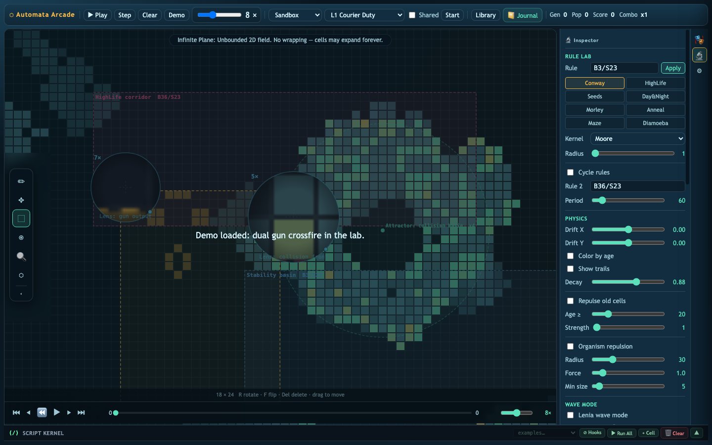
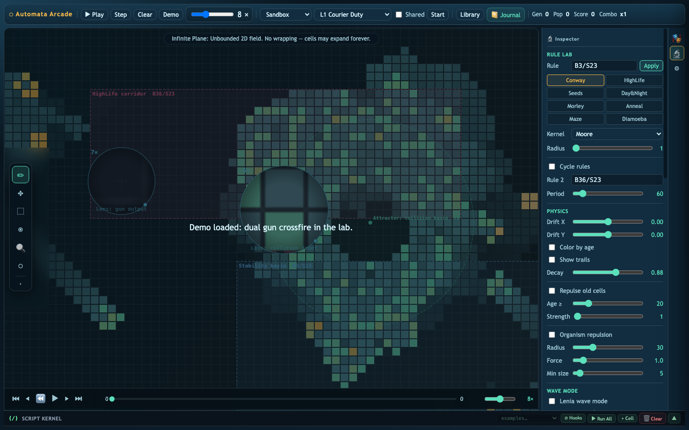
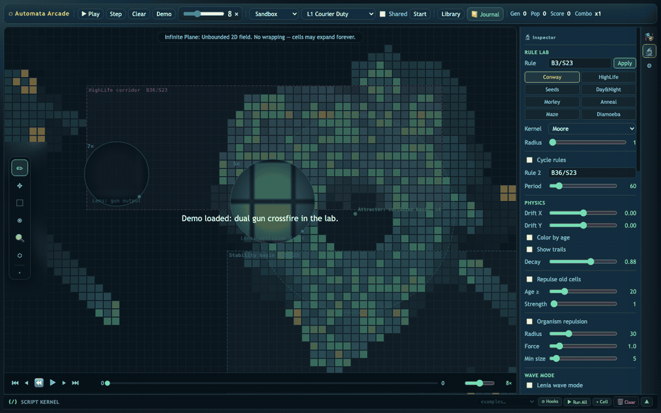
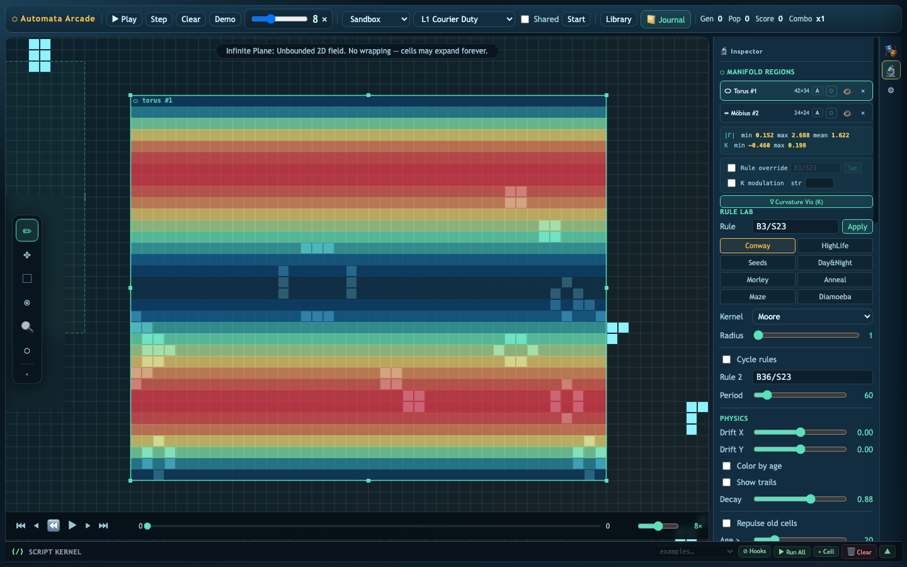
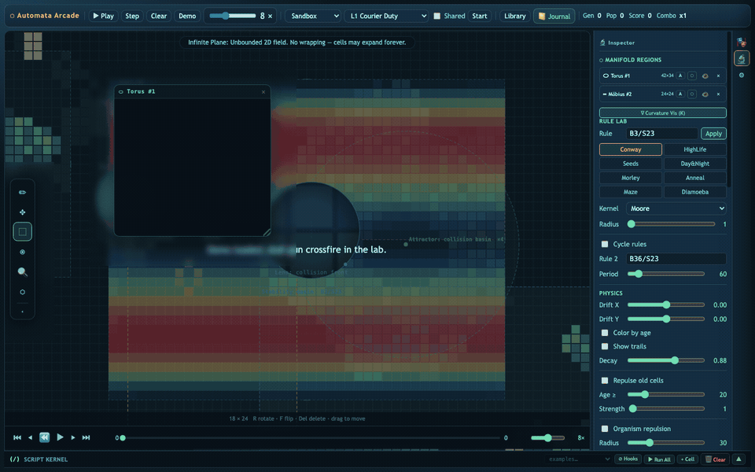

# Automata Arcade Is Becoming an Instrument

*What we built since the last update: lenses, zones, selection transforms, copy/cut/paste, and automata mapped onto manifolds.*

Automata Arcade started as a playful cellular automata sandbox. You could paint life onto a grid, press play, and watch little machines collide.

That is still there. But the project has crossed a threshold: it is no longer only a place to *run* automata. It is becoming a place to **compose, inspect, transform, and reason with them**.

Try it here: [Automata Arcade live demo](https://automata-arcade.vercel.app) · [GitHub repository](https://github.com/jclosure/automata-arcade)

The new version feels less like a toy canvas and more like a small creation IDE for emergent systems: part arcade, part microscope, part geometry lab, part notebook.

## The board is now an editable object

The biggest shift is that the board is no longer just a bitmap of living and dead cells. It has tools.

Selection mode turns a patch of life into something you can operate on:

- draw a rectangular selection around an active mechanism
- translate it across the board
- rotate it 90 degrees
- flip it
- copy, cut, and paste it somewhere else
- capture the result as a reusable prefab

That sounds ordinary if you come from image editors. In cellular automata, it is quietly powerful. A glider stream, oscillator, eater, failed collision, or partial circuit is not just an accident anymore. It can become material.

You can take a reaction that almost works, move it two cells over, rotate it into phase, paste a second copy downstream, and keep experimenting without rebuilding the whole machine from scratch.

That changes the rhythm of discovery. Instead of “clear, redraw, hope,” the loop becomes:

1. observe a behavior
2. isolate the interesting region
3. transform it
4. test the altered geometry
5. save what survives

This is exactly the kind of workflow a serious automata workbench needs.

## Lenses make local behavior legible

We also added lenses: circular magnifiers that live directly on the canvas.

The important detail is that a lens does **not** zoom the whole world. It magnifies a local region while the global scene remains visible.

That matters because automata are multiscale. You often need to see two things at once:

- the local neighbor-level mechanism: births, deaths, collisions, phase offsets
- the global consequence: streams, boundaries, population waves, circuit timing

A normal zoom forces you to choose. Lenses let you keep context.

They make the board feel more like an analysis surface: you can place one lens over the gun output, another over the collision front, and compare cause and effect while the system runs.

## Zones turn the board into an ecology

Zones are rectangular regions with their own rule overrides. A cell can live in one part of the board under classic Life and cross into another region governed by HighLife, Seeds, Day & Night, or a custom B/S rule.

That turns the plane from a neutral stage into a designed environment.

A zone can be:

- a reaction chamber
- a protected basin
- a hostile boundary
- a rule-gradient experiment
- an arcade objective
- a computational component

This is where Automata Arcade starts to feel like a laboratory. You are no longer asking only, “What does this rule do?” You can ask, “What happens when this organism crosses into another physics?”

That is a much richer question.

## Regions can now be mapped to manifolds

The most ambitious new feature is Manifold Regions.

Instead of switching the whole world into a sphere, torus, Möbius strip, or Klein bottle, you can mark a rectangular region of the ordinary board and map that region onto a topology.

This is a strange and exciting idea: local topology embedded in a flat automata workspace.

A glider can encounter a patch where edges wrap like a torus. Another stream can cross a Möbius seam. The same birth/survival rules can produce different behavior because the neighbor relationships have changed.

That is the key lesson: in cellular automata, “the rule” is not the whole system. Geometry is part of the machine.

Manifold Regions make that visible and editable. They let us treat topology as a creative material, not just as a rendering mode.

## The IDE shape is emerging

Several systems are now converging:

- the canvas tools: paint, select, transform, stamp
- the analysis tools: period detection, population tracking, heatmaps
- the rule tools: presets, B/S editing, kernel radius, Lenia controls
- the spatial tools: zones, force fields, lenses
- the topology tools: manifold regions and curvature visualization
- the journal/script direction: experiments can become documented, replayable scenes

That combination is the real story.

Automata Arcade is becoming a place where someone can build an automaton, study it, annotate it, mutate it, and turn discoveries into reusable parts.

The “arcade” is still important. Play keeps the system approachable. But underneath the play, we are building an instrument.

## What this teaches

A cellular automaton is often introduced as a grid plus a rule. Automata Arcade now demonstrates a more complete model:

> behavior = rule × initial condition × tools × geometry × observation

The same seed behaves differently when selected and rotated. It behaves differently inside a zone. It behaves differently under a lens because the observer notices different facts. It behaves differently when part of the board has toroidal adjacency.

That is a wonderful teaching surface.

Beginners can still paint cells and press Play. More advanced users can ask deeper questions:

- What makes a structure stable?
- Which collisions are phase-sensitive?
- Can a region boundary act like a diode?
- Can topology preserve, destroy, or transform signals?
- Can we compose Life mechanisms the way we compose circuits?

The tool is starting to answer those questions visually.

## Where should we go next?

Here are the directions that feel most alive.

### 1. A true experiment notebook

The journal should become more than notes. It should capture:

- board state
- rule configuration
- selected regions
- camera/lens positions
- script cells
- manifold mappings
- replayable timelines

Then every discovery becomes reproducible. A reader could open a journal entry and step through the exact moment where a collision becomes a gate.

### 2. A prefab ecology

Selections should graduate into a living library: not just static patterns, but annotated organisms and machines.

Imagine prefab cards that know:

- period
- bounding box
- velocity
- input/output lanes
- required phase
- compatible rules
- known failure modes

Then users could build with glider guns, eaters, reflectors, oscillators, and gates as semantic components.

### 3. Topology as a first-class programming tool

Manifold Regions are the beginning. Next we can ask: can topology compute?

Could a Möbius strip invert a signal? Could a torus preserve circulation? Could a Klein bottle produce useful interference patterns? Could region seams become logic boundaries?

The ambitious version is a topology workbench where users design spatial circuits by editing adjacency itself.

### 4. Search, evolution, and synthesis

The Evo Lab can become a discovery engine.

Give the system a target — sustain population, emit a glider, stabilize a boundary, make a periodic oscillator, survive a topology seam — and let it search over rules, seeds, zones, and transforms.

Not to replace human creativity, but to give the human strange candidates they would never draw by hand.

### 5. A publishable atlas of automata phenomena

Automata Arcade could host an atlas: a curated collection of scenes, rules, mechanisms, manifolds, and experiments.

Each entry would be interactive, not just a screenshot. Readers could inspect it, fork it, mutate it, and publish their own variations.

That would turn the project from a tool into a community knowledge base.

## The feeling

The best part of this update is not any single feature. It is the feeling of working with the system.

You can watch a collision, drop a lens on it, draw a zone around it, select the survivor, rotate it, paste it into another region, and then ask what happens if that region is no longer flat.

That is the moment Automata Arcade becomes something special.

Not just a simulation.

A place to make discoveries.
