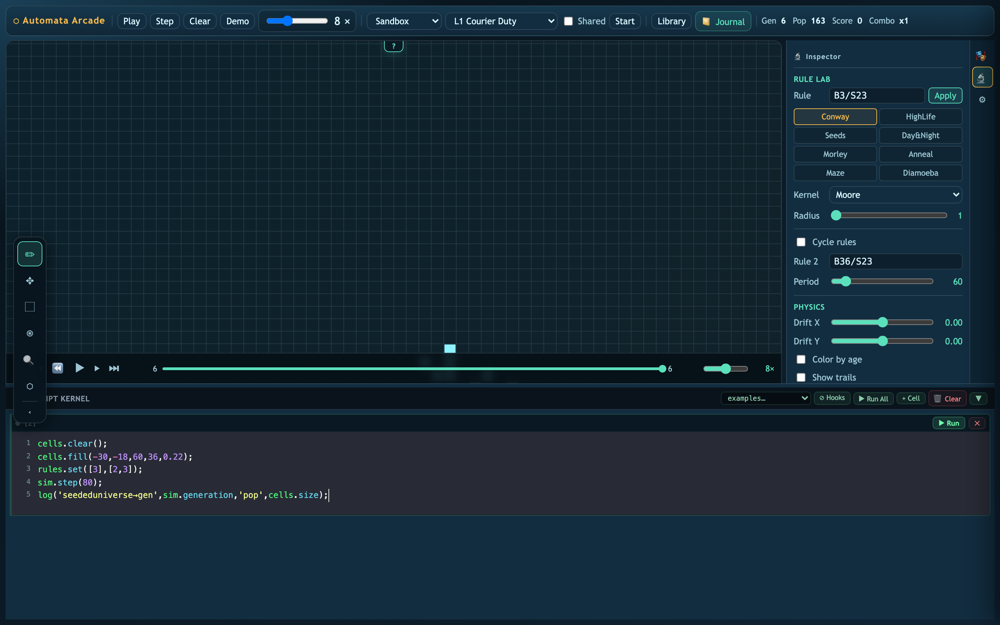
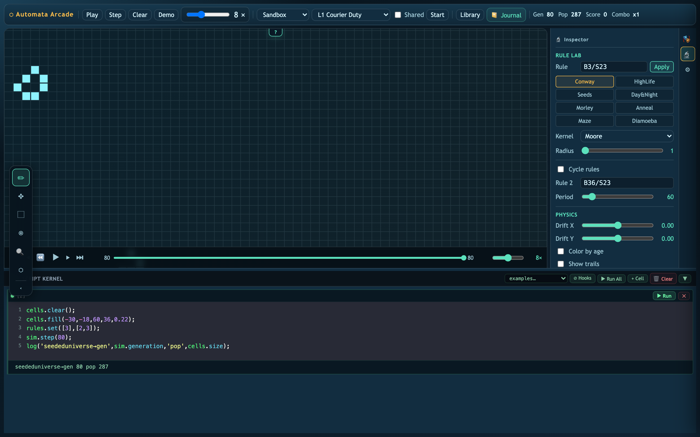
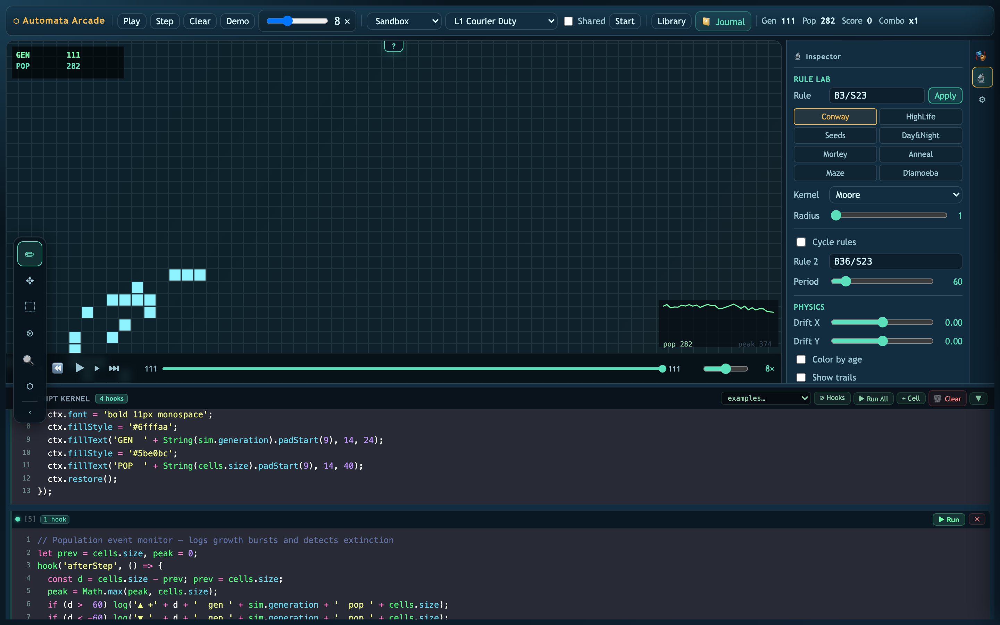
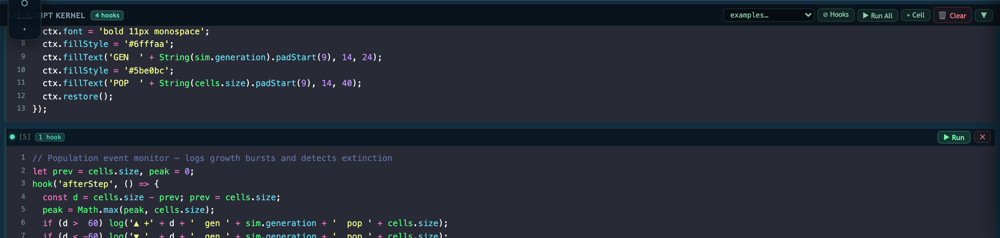
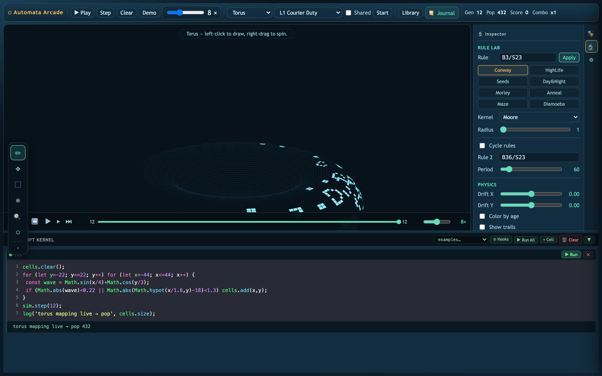

# Automata Arcade Is Becoming an Instrument

*Lenses, zones, copy/paste transforms, manifold worlds, and now a live Script Kernel: Automata Arcade is turning from a sandbox into a programmable laboratory for emergent systems.*

Automata Arcade started as a friendly Conway's Game of Life playground. Paint cells. Press Play. Watch tiny machines appear, collide, self-destruct, and occasionally surprise you.

That is still the door in. But the project has crossed a threshold.

It is no longer only a place to *run* automata. It is becoming a place to **compose, instrument, mutate, measure, and reason with them** — a creation IDE for small universes.

Try it here: [Automata Arcade live demo](https://automata-arcade.vercel.app) · [GitHub repository](https://github.com/jclosure/automata-arcade)



If you are a developer, this is the fun part: the simulation is programmable from the inside. If you are a mathematician, the fun part is stranger: rules, initial conditions, geometry, topology, and observation are all editable objects. You can make a little universe, perturb its laws, and watch what survives.

That is the vibe of this update: part arcade, part microscope, part notebook, part geometry lab, part invitation to ask dangerous little questions about computation and reality.

## The board is now material

The first big change is that the board no longer feels like a bitmap of living/dead cells. It feels like material.

Selection mode lets you draw a rectangle around an active mechanism and operate on it:

- move it
- rotate it
- flip it
- copy it
- cut it
- paste it
- capture it as a reusable prefab


That sounds ordinary if you come from image editors. In cellular automata, it is quietly radical.

A glider stream, oscillator, eater, failed collision, partial gate, or weird survivor is no longer just an accident on the board. It becomes something you can pick up and work with.

You can take a reaction that almost works, move it two cells over, rotate it into phase, paste a second copy downstream, and test the altered geometry without rebuilding the whole machine from scratch.

The discovery loop changes from:

> clear, redraw, hope

into:

> observe, isolate, transform, test, preserve

That is what a serious automata workbench needs. Not just simulation. Editing.

## Lenses make local behavior legible

Automata are multiscale. The local mechanism and the global consequence are both important.

A lens gives you both.


A normal zoom forces you to choose between detail and context. Lenses stay on the board. You can place one over a gun output, another over a collision front, and keep the whole system visible while studying neighbor-level behavior.

That matters because a lot of automata work is phase work. One cell of offset can change everything. A lens makes those tiny differences visible without losing the larger machine.

## Zones turn the plane into an ecology

Zones are rectangular regions with their own rule overrides. A cell can cross from classic Life into HighLife, Seeds, Day & Night, or any custom B/S rule.

That turns the board from a neutral plane into an ecology.

A zone can be:

- a reaction chamber
- a protected basin
- a hostile boundary
- a rule-gradient experiment
- an arcade objective
- a computational component

Instead of only asking, “What does this rule do?” you can ask, “What happens when an organism crosses into another physics?”

That is a much richer question.

## The Script Kernel makes it a live notebook

The biggest new affordance is the Script Kernel: a cell-based JavaScript notebook embedded directly under the simulation.

It is not a dev console next to the game. It is **Jupyter notebooks over live game state**.

You type into a cell, run it, and the universe above reacts.



A cell can be a one-line probe:

```js
log('gen:', sim.generation, 'pop:', cells.size, 'rules:', rules.toString());
```

It can be a world generator:

```js
cells.clear();
cells.fill(-30, -18, 60, 36, 0.22);
rules.set([3], [2, 3]);
sim.step(80);
log('seeded universe → gen', sim.generation, 'pop', cells.size);
```

Or it can become a persistent instrument attached to the engine:

```js
const hist = globals.population ??= [];

hook('afterStep', () => {
  hist.push(cells.size);
  if (hist.length > 300) hist.shift();
});

hook('afterDraw', () => {
  const { ctx, width, height } = canvas;
  ctx.fillStyle = '#5be0bc';
  ctx.fillText(`pop ${cells.size}`, width - 90, height - 24);
});
```



That last example is the important leap. Scripts are not only commands. They can become live probes.

The SDK is intentionally tiny:

- `cells` reads and edits the alive-cell set
- `rules` inspects and changes B/S rules
- `sim` steps, plays, pauses, and reports generation count
- `canvas` exposes the drawing context for overlays and instruments
- `globals` persists data across cells and reruns
- `hook()` attaches code to `afterStep`, `beforeDraw`, or `afterDraw`
- `manifold` exposes curvature/topology data for active manifold regions
- `log()` / `print()` writes straight into the cell output

That gives developers a low-friction playground. A few lines can become:

- a population oscilloscope
- a collision detector
- a scripted seed generator
- a rule-sweep harness
- a topology probe
- a visual debugger
- a one-off research instrument
- a tiny experiment runner



The ergonomics matter. Cells show `ok`, `err`, or `hooked`. Rerunning a cell cleans up its old hooks, so iteration does not leave ghost callbacks behind. There is a Run All button, a sample dropdown, hook pause/resume, output strips, and keyboard command mode.

You can still paint with the mouse. But when you need precision, repetition, measurement, or visualization, you script the world in place.

That is where the project starts to feel less like “a Life implementation” and more like a laboratory bench.

## Topology is becoming editable

The most mathematically exciting direction is manifold support.

Automata Arcade can run the same local update rules on curved or identified spaces: sphere, torus, Klein bottle, Möbius strip, cylinder. The rendered surface changes, but the underlying lesson is deeper: adjacency is part of the machine.



A torus is not just a pretty mesh. It is a different neighbor relationship. A glider that would leave the edge on a flat finite board can wrap. A wavefront can meet itself. A collision can be created by topology rather than by another object.

This is the automata version of a deep mathematical move: keep the local law, change the space it acts on, and study what invariants survive.

That is why manifold regions are so interesting. Eventually, the whole board should not have to be one topology. You should be able to embed a toroidal patch in a flat world, route a signal through it, and ask what the seam computes.

Could a Möbius strip invert orientation? Could a torus preserve circulation? Could a Klein bottle create useful interference? Could topology become a programming primitive?

Those are the kinds of questions this tool is starting to make tangible.

## Why this matters beyond the toy

Cellular automata are often introduced as “grid plus rule.” That is true, but incomplete.

A better mental model is:

> behavior = rule × initial condition × geometry × boundary × observation

Automata Arcade is becoming a place where every term in that equation is editable.

That matters because automata are a primitive model for one of the biggest ideas in science: **local laws can generate global reality**.

To be precise: Conway's Life is not the Standard Model. The Standard Model is a quantum field theory with gauge symmetries, fields, particles, interactions, renormalization, and an enormous amount of experimentally validated structure. A binary cellular automaton is not secretly particle physics.

But automata are a powerful toy model for developing the right intuitions.

They let us ask Standard-Model-shaped questions in a world small enough to hold in our hands:

- What does locality buy you?
- Which patterns behave like persistent particles?
- Which interactions conserve information?
- Which collisions annihilate, scatter, bind, or transmit?
- Which symmetries matter?
- How does geometry affect dynamics?
- Can a stable object be nothing more than a process that keeps reproducing itself?

A glider does not know it is a glider. It is not an object in the rule table. It is a recurring pattern — an emergent identity created by local transitions. That is the philosophical electricity of cellular automata.

They suggest a way of thinking where “things” are not fundamental. Processes are. Relations are. Update rules are. Symmetries are. Stable patterns are what local law looks like after time has had a chance to work.

That is why this project is exciting. We are not simulating life because pixels are alive. We are simulating life because artificial life gives us a handle on emergence. And emergence may be one of the only ways minds like ours can build intuition for the simulation we appear to be living in.

Automata Arcade is not a proof of digital physics. It is an intuition engine.

## Applications hiding in the playground

The playful interface hides serious applications:

- **Education** — teach emergence, phase, locality, topology, and computation visually.
- **Research sketches** — prototype cellular rules, boundary conditions, probes, and metrics quickly.
- **Artificial life** — search for stable organisms, ecologies, lifecycles, and failure modes.
- **Computational design** — compose glider logic, gates, reflectors, and rule-boundary devices.
- **Dynamical systems** — study attractors, oscillators, phase transitions, and perturbation sensitivity.
- **Mathematical visualization** — show how changing topology changes behavior without changing the local rule.
- **Creative coding** — use the Script Kernel to turn automata into generative instruments.

The arcade wrapper matters because play lowers the activation energy. You can arrive as a beginner, paint cells, and enjoy the chaos. Then, if curiosity catches, the tool opens downward: rules, lenses, zones, scripts, manifolds, notebooks, measurements.

That is the right shape for a learning instrument.

## Where it wants to go next

A few directions feel especially alive.

### A true experiment notebook

The Journal and Script Kernel should converge into reproducible computational essays. A saved experiment should capture:

- board state
- rule configuration
- selected regions
- camera and lens positions
- script cells
- manifold mappings
- timeline snapshots
- replayable scenes

Then a discovery is not just a screenshot. It is something another person can open, run, inspect, fork, and mutate.

### A prefab ecology

Selections should become a semantic library of organisms and machines.

Imagine prefab cards that know their period, velocity, bounding box, input/output lanes, compatible rules, required phase, and known failure modes.

Then users could build with glider guns, eaters, reflectors, oscillators, and gates as components rather than raw pixels.

### Topology as a programming language

Manifold Regions are the start. The ambitious version is a topology workbench where users compute by editing adjacency itself.

Not just “place a gate here,” but “route this signal through a non-orientable region and see whether the seam transforms it.”

That is the kind of weirdness worth building tools for.

### Search, evolution, and synthesis

The Evo Lab can become a discovery engine.

Give the system a target — sustain population, emit a glider, stabilize a boundary, survive a topology seam — and let it search over rules, seeds, zones, transforms, and scripts.

Not to replace human creativity, but to hand the human strange candidates they would never draw by hand.

## Come play with the machinery

The best part of this update is the feeling of working with the system.

You can watch a collision, drop a lens on it, draw a zone around it, select the survivor, rotate it, paste it into another region, open a script cell, attach a population probe, and then ask what happens if that region is no longer flat.

That is the moment Automata Arcade becomes something special.

Not just a simulation.

A tiny universe with handles.

If you like compilers, shaders, category theory, dynamical systems, artificial life, topology, complex systems, cellular automata, or the weird borderland where math starts to look alive, come play.

Fork it. Script it. Break it. Add a detector. Add a new topology. Teach it to search. Build an atlas. Make it stranger.

We are simulating life because life may be what computation looks like from the inside.

And the only way to learn what these little universes can do is to start running them.
